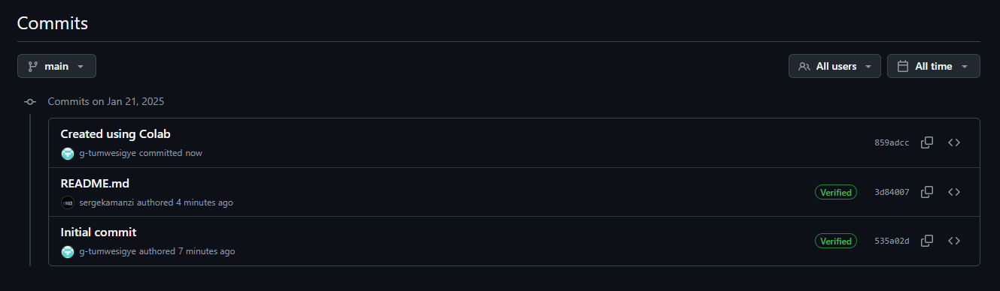
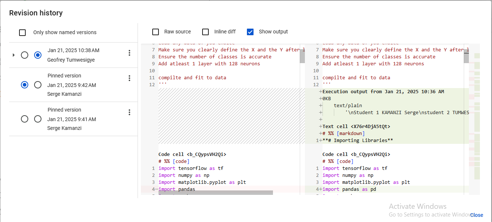

# Group members
KAMANZI SERGE AND 
TUMWESIGYE GEOFREY

## Screenshots

### proof1


###  proof2


# MNIST Handwritten Digit Classification

This project demonstrates the training, evaluation, and saving of a neural network model for classifying handwritten digits from the MNIST dataset using TensorFlow and Keras.

---

## Table of Contents
1. [Project Overview](#project-overview)
2. [Dataset](#dataset)
3. [Preprocessing](#preprocessing)
4. [Model Architecture](#model-architecture)
5. [Training](#training)
6. [Evaluation](#evaluation)
7. [Saving and Loading the Model](#saving-and-loading-the-model)
8. [Results](#results)
9. [How to Run](#how-to-run)
10. [Dependencies](#dependencies)

---

## Project Overview
This project utilizes a simple feedforward neural network to classify images of handwritten digits from the MNIST dataset. The model is trained to achieve high accuracy on both training and validation datasets and is capable of predicting the class of new handwritten digits.

## Dataset
The MNIST dataset is a standard dataset for image classification, containing 70,000 grayscale images of handwritten digits (28x28 pixels) divided into:
- **Training set**: 60,000 images
- **Test set**: 10,000 images

## Preprocessing
1. **Normalization**: Pixel values are normalized to the range [0, 1] by dividing by 255.0.
2. **Flattening**: Each 28x28 image is reshaped into a vector of 784 features.
3. **One-Hot Encoding**: Labels are converted to one-hot encoded vectors for multi-class classification.

## Model Architecture
The model is a sequential neural network with the following layers:
1. **Dense Layer**: 128 neurons, ReLU activation, input shape of 784.
2. **Output Layer**: 10 neurons (one for each class), softmax activation.


## Training
The model is trained using the `fit` method for 10 epochs with the following parameters:
- Training data: 60,000 images
- Validation data: 10,000 images
- Batch size: Default (32)

### Training Output:
```plaintext
Epoch 1/10
Accuracy: 87.79%, Loss: 0.4327
Validation Accuracy: 96.07%, Validation Loss: 0.1307
...
Epoch 10/10
Accuracy: 99.59%, Loss: 0.0141
Validation Accuracy: 97.82%, Validation Loss: 0.0777
```

## Evaluation
The model achieves a validation accuracy of **97.82%**, demonstrating strong performance on unseen data.

## Saving and Loading the Model
The trained model is saved as an HDF5 file:
```python
model.save('mnist_model.h5')
```
To reload and use the model:
```python
loaded_model = tf.keras.models.load_model('mnist_model.h5')
```

## Results
The model was tested on unseen data and accurately classified digits. For example, testing the first image in the test set resulted in:
- **Predicted class**: 7

## How to Run
1. Clone this repository or download the script.
2. Ensure all dependencies are installed (see below).
3. Run the script to train the model:
   ```bash
   python mnist_model.py
   ```
4. Evaluate the model and make predictions using the saved model.

## Dependencies
- Python 3.x
- TensorFlow
- NumPy

To install the dependencies, run:
```bash
pip install tensorflow numpy matplotlib pandas
```

---

